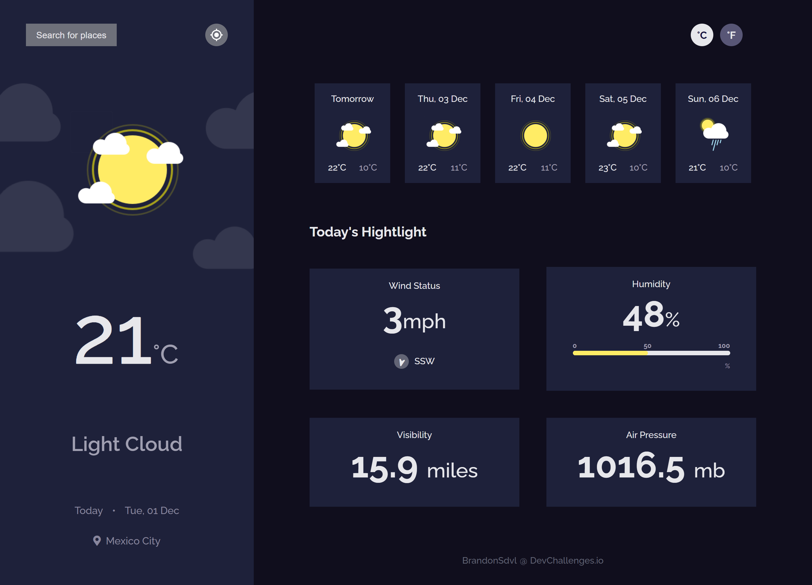

<h1 align="center">Weather App</h1>

<div align="center">
   Solution for a challenge from  <a href="http://devchallenges.io" target="_blank">Devchallenges.io</a>.
</div>

<div align="center">
  <h3>
    <a href="https://weather-app-b.web.app/">
      Demo
    </a>
    <span> | </span>
    <a href="https://devchallenges.io/solutions/CQUHKDCzfJpMRIW1stcd">
      Solution
    </a>
    <span> | </span>
    <a href="https://devchallenges.io/challenges/mM1UIenRhK808W8qmLWv">
      Challenge
    </a>
  </h3>
</div>

<!-- TABLE OF CONTENTS -->

## Table of Contents

- [Overview](#overview)
  - [Built With](#built-with)
- [Features](#features)
- [How to use](#how-to-use)
- [Contact](#contact)
- [Acknowledgements](#acknowledgements)

<!-- OVERVIEW -->

## Overview



This is a responsive Vue app hosted in [Firebase](https://firebase.google.com/) that provides you with the weather of any city you want to search, it is done using the [AccuWeather](https://developer.accuweather.com/) API and [Pinia](https://pinia.vuejs.org/) to store the data.

### Built With

<!-- This section should list any major frameworks that you built your project using. Here are a few examples.-->

- [Vue.js](https://vuejs.org/)
- [Sass](https://sass-lang.com/)

## Features

<!-- List the features of your application or follow the template. Don't share the figma file here :) -->

This application/site was created as a submission to a [DevChallenges](https://devchallenges.io/challenges) challenge. The [challenge](https://devchallenges.io/challenges/mM1UIenRhK808W8qmLWv) was to build an application to complete the given user stories.

- User story: I can see city weather as default, preferably my current location
- User story: I can search for city
- User story: I can see weather of today and the next 5 days
- User story: I can see the date and location of the weather
- User story: I can see according to image for each type of weather
- User story: I can see the min and max degree each day
- User story: I can see wind status and wind direction
- User story: I can see humidity percentage
- User story: I can see visibility indicator
- User story: I can see air pressure number
- User story(optional): I can request my current location weather
- User story(optional): I can convert temperature in Celcius to Fahrenheit and vice versa

## How To Use

<!-- Example: -->

To clone and run this application, you'll need [Git](https://git-scm.com) and [Node.js](https://nodejs.org/en/download/) (which comes with [npm](http://npmjs.com)) installed on your computer. From your command line:

```bash
# Clone this repository
$ git clone https://github.com/BrandonSdvl/Weather-app.git

# Install dependencies
$ npm install

# Run server
$ npm run dev
```

## Acknowledgements

<!-- This section should list any articles or add-ons/plugins that helps you to complete the project. This is optional but it will help you in the future. For example: -->

- [AccuWeather](https://developer.accuweather.com/)
- [FontAwesome](https://fontawesome.com/)

## Contact

- GitHub [@BrandonSdvl](https://github.com/BrandonSdvl)
